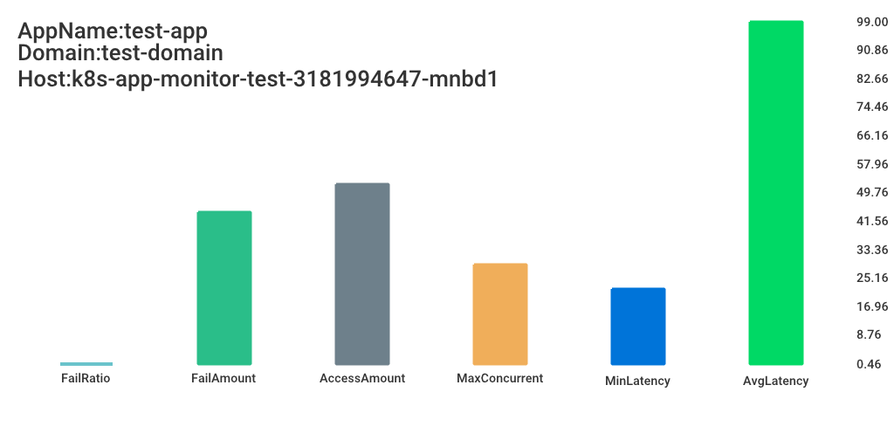

[](https://app.wercker.com/project/byKey/5f9c6c840c21111c17ec08ee9169347f)

# Kubernetes application monitor agent

This is a sample code used by [kubernetes-handbook](https://github.com/rootsongjc/kubernetes-handbook)

Get the metrics from the service  [k8s-app-monitor-test](https://github.com/rootsongjc/k8s-app-monitor-test) and show a chart in the web browser, every time you refresh the browser will get a new chart.



**Note**: This app depend on [k8s-app-monitor-test](https://github.com/rootsongjc/k8s-app-monitor-test) so that it cannot running alone.

## Usage

**Step1 Change image tags**

Based on the image tags in fact, change the tag for  `monitor-agent` and `monitor-test` images.

**Step2 Rock it**

Make sure `docker-compose` has been installed already and then run the following command.

```bash
docker-compose up
```

**Step3 View in browser**

Open the following URL in your brower.

http://localhost:8888

You will see the picture in the beginning. Try to refresh the page, you will see different date every time you fresh the page.